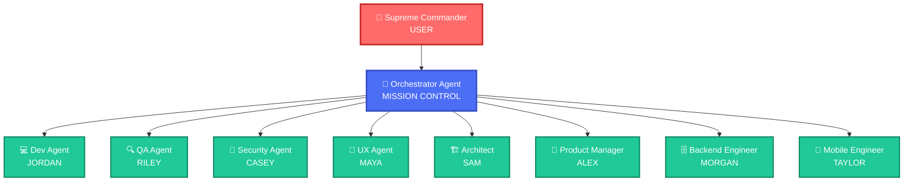

<div align="center">

# ⚡ AGENT BATTALION ⚡

### *Autonomous Multi-Agent Orchestration Grid v3.0*

</div>

---

<div align="center">

### ━━━━━━━ SYSTEM STATUS ARRAY ━━━━━━━

`[ SYSTEM: ONLINE ]` `[ AGENTS: 8 ACTIVE ]` `[ CORE: TYPESCRIPT ]` `[ LATENCY: NOMINAL ]`

</div>

---

## 🎯 THE NEURAL MAP



---

## 🤖 AGENT ROSTER

<div align="center">

| CODENAME | SPECIALTY | ACCESS LEVEL |
|----------|-----------|--------------|
| 👔 **ALEX** | Product Manager - Requirements Analysis & Project Scoping | **ALPHA** |
| 🏗️ **SAM** | System Architect - Infrastructure Design & Tech Stack | **ALPHA** |
| 🎨 **MAYA** | UX Designer - Design Systems & Tailwind Configuration | **BETA** |
| 💻 **JORDAN** | Frontend Engineer - Next.js 15, React 19, Component Assembly | **BETA** |
| 🗄️ **MORGAN** | Backend Engineer - Prisma, API Routes, Authentication | **BETA** |
| 🔐 **CASEY** | Security Specialist - Vulnerability Scanning & OWASP Audit | **GAMMA** |
| 📱 **TAYLOR** | Mobile Engineer - React Native / Expo Deployment | **BETA** |
| 🔍 **RILEY** | QA Engineer - Code Review, Accessibility, Testing Protocols | **GAMMA** |

</div>

---

## ⚙️ CORE CAPABILITIES

- **🧠 Multi-Provider LLM Intelligence** - Claude, GPT-4, Gemini with automatic failover
- **⚡ Real-Time Collaboration** - Watch agents coordinate via Socket.IO
- **🛡️ Security Hardened** - Vulnerability scanning, OWASP Top 10 compliance
- **🔬 86 Unit Tests** - Comprehensive test coverage with 88/100 QA score
- **📦 Docker Ready** - Production containerization with temporal workflows
- **🎯 CLI Interface** - Generate complete applications from command line

---

## 🚀 DEPLOYMENT PROTOCOL

### INITIATE SEQUENCE

```bash
# CLONE THE BATTALION
git clone https://github.com/adzry/agentbatallion.git
cd agentbatallion

# INJECT DEPENDENCIES
npm install

# CONFIGURE ENVIRONMENT
cp .env.example .env
# Edit .env and add your API keys

# WAKE THE LEGION
npm run dev
```

**Mission Control Terminal:** `http://localhost:4000`

### COMMAND LINE OPERATIONS

```bash
# GENERATE APPLICATION
npm run cli -- create "Build a todo app" --output ./my-app

# DEPLOY WITH REAL AI
npm run cli -- create "Build a blog" --output ./blog --real-ai

# LIST LLM PROVIDERS
npm run cli -- providers

# START WEB SERVER
npm run cli -- serve --port 4000
```

---

## 🖥️ SYSTEM HUD


*Upload a screenshot of the application running to `.github/assets/demo_placeholder.png`*

---

## 🏗️ SYSTEM ARCHITECTURE

```
agentbatallion/
├── packages/
│   └── agent-battalion/          # CORE SYSTEM
│       ├── src/
│       │   ├── agents/           # AI AGENT MODULES
│       │   │   ├── team/         # SPECIALIZED OPERATIVES
│       │   │   ├── team-orchestrator.ts
│       │   │   └── base-team-agent.ts
│       │   ├── cli/              # COMMAND INTERFACE
│       │   ├── llm/              # LLM SERVICE LAYER
│       │   ├── memory/           # NEURAL MEMORY
│       │   ├── communication/    # MESSAGE BUS
│       │   ├── tools/            # TOOL REGISTRY
│       │   ├── temporal/         # WORKFLOW ENGINE
│       │   └── web/              # HTTP SERVER
│       └── __tests__/            # VALIDATION SUITE
├── docker-compose.yml
├── Dockerfile
└── README.md
```

---

## 🔧 ENVIRONMENT CONFIGURATION

```env
# LLM PROVIDER SELECTION
LLM_PROVIDER=anthropic
USE_REAL_AI=true

# API CREDENTIALS
ANTHROPIC_API_KEY=sk-ant-xxx
OPENAI_API_KEY=sk-xxx
GOOGLE_AI_API_KEY=xxx

# OPTIONAL: VECTOR MEMORY
PINECONE_API_KEY=xxx

# OPTIONAL: CODE SANDBOX
E2B_API_KEY=xxx
```

---

## 🎯 GENERATED OUTPUT SPECS

Each generated project includes:

- ✅ **Next.js 15** App Router with TypeScript
- ✅ **Tailwind CSS** Design System
- ✅ **React 19** Components with proper types
- ✅ **API Routes** with Zod validation
- ✅ **WCAG 2.1** Accessibility compliance
- ✅ **QA Report** with code quality metrics

---

## 🐳 DOCKER DEPLOYMENT

```bash
# BUILD AND DEPLOY
docker-compose -f docker-compose.prod.yml up -d

# MONITOR OPERATIONS
docker-compose logs -f agent-battalion
```

---

## 🧪 TESTING PROTOCOLS

```bash
# RUN ALL TESTS
npm test

# WATCH MODE
npm run test:watch

# COVERAGE REPORT
npm run test:coverage
```

---

## 🔒 SECURITY PROTOCOLS

- **Vulnerability Scanning** - Detects XSS, SQL injection, secrets
- **OWASP Top 10** - Comprehensive security audit
- **Input Validation** - Zod schemas for all inputs
- **Multi-Provider Failover** - Automatic LLM redundancy

---

## 📊 API INTEGRATION

```typescript
import { createTeamOrchestrator } from '@meta/agent-battalion';

const orchestrator = createTeamOrchestrator({
  projectName: 'My App',
});

orchestrator.on('progress', (data) => {
  console.log(`${data.agent}: ${data.message}`);
});

const result = await orchestrator.run('Build a task management app');
console.log(`Generated ${result.files.length} files`);
console.log(`QA Score: ${result.qaReport?.score}/100`);
```

---

## 📈 MISSION ROADMAP

- [x] CLI Tool Deployment
- [x] Unit Tests (86 tests)
- [x] Multi-Provider LLM with failover
- [x] Code Quality Improvements
- [ ] VS Code Extension
- [ ] Custom Agent Creation
- [ ] Cloud Deployment (Vercel, Netlify)

---

## 🤝 ENLISTMENT

Want to join the battalion? See [CONTRIBUTING.md](./CONTRIBUTING.md) for enlistment protocols.

---

## 📄 LICENSE

MIT License - See [LICENSE](./LICENSE) for details.

---

<div align="center">

### ━━━━━━━━━━━━━━━━━━━━━━━━━━━━━━━━━━━━━━━━

**AGENT BATTALION** | *Powered by Multi-Agent Orchestration* | v3.0

━━━━━━━━━━━━━━━━━━━━━━━━━━━━━━━━━━━━━━━━

</div>
